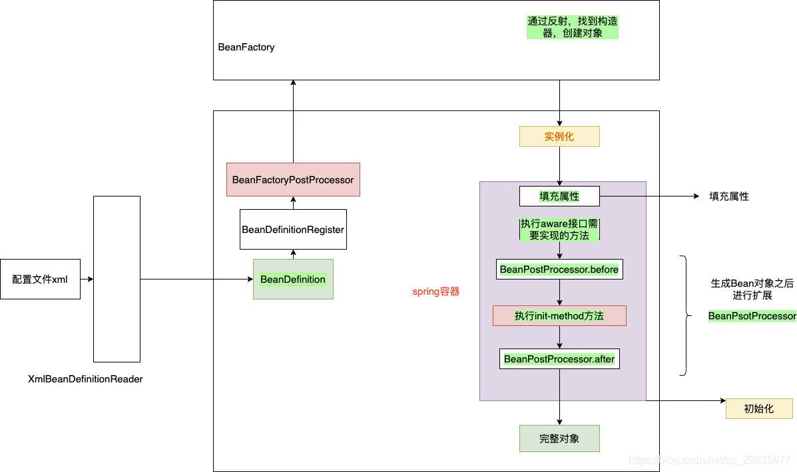
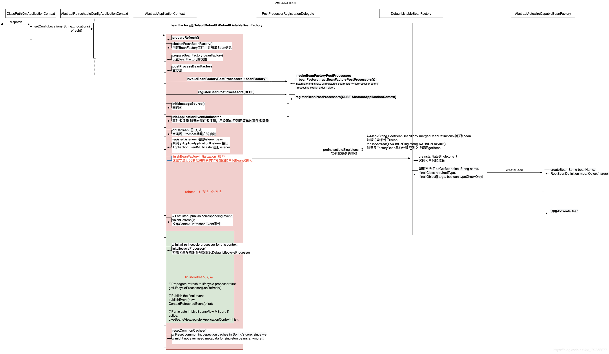

# Spring源码分析

## 1.整体的流程



1. 将xml的配置加载进来，之后保存在DeanDefinition中
2. 将Bean的定义属性通过BeanDefinitionRegister注册
3. 通过BeanFactory创建对象
4. 实列化对象
5. 初始化

### spring项目启动时序图



### Spring最终要的方法在 AbstractApplicationContext 中 refresh()

```java

public void refresh()throws BeansException,IllegalStateException{
synchronized (this.startupShutdownMonitor){
        StartupStep contextRefresh=this.applicationStartup.start("spring.context.refresh");
        
        // 准备刷新----准备工作
        prepareRefresh();

        // 创建对象工厂
        ConfigurableListableBeanFactory beanFactory=obtainFreshBeanFactory();

        // 准备对象工程，设置一些工厂的初始化值
        prepareBeanFactory(beanFactory);

        try{
        // 对象工厂处理器，里面空方法，可以扩展使用
        postProcessBeanFactory(beanFactory);

        // 应用程序启动-启动
        StartupStep beanPostProcess=this.applicationStartup.start("spring.context.beans.post-process");
        
        // 调用对象工厂处理器
        invokeBeanFactoryPostProcessors(beanFactory);

        // 注册bean创建的bean处理器
        registerBeanPostProcessors(beanFactory);
        beanPostProcess.end();

        // 国际化处理
        initMessageSource();

        // 初始化程序的广播器，方便我们以后发布监听事件
        initApplicationEventMulticaster();

        // 空事件
        onRefresh();

        // 注册监听器
        registerListeners();

        // 实例化所有剩余的(非懒加载)单例对象
        finishBeanFactoryInitialization(beanFactory);

        // Last step: publish corresponding event.
        finishRefresh();
        
        }catch(BeansException ex){
        if(logger.isWarnEnabled()){
        logger.warn("Exception encountered during context initialization - "+
        "cancelling refresh attempt: "+ex);
        }

        // Destroy already created singletons to avoid dangling resources.
        destroyBeans();

        // Reset 'active' flag.
        cancelRefresh(ex);

        // Propagate exception to caller.
        throw ex;
        }

        finally{
        // Reset common introspection caches in Spring's core, since we
        // might not ever need metadata for singleton beans anymore...
        resetCommonCaches();
        contextRefresh.end();
        }
        }
        }
```

1. 代码中的 prepareRefresh()方法是是 准备工作 代码如下

```java

protected void prepareRefresh(){
        // 设置时间
        this.startupDate=System.currentTimeMillis();
        // 设置容器关闭
        this.closed.set(false);
        // 设置容器活跃
        this.active.set(true);

        // 初始化属性资源（里面方法是空的）
        initPropertySources();

        // 获取环境变量，并且验证属性值
        getEnvironment().validateRequiredProperties();

        // 存储刷新 ApplicationListeners...
        if(this.earlyApplicationListeners==null){
        this.earlyApplicationListeners=new LinkedHashSet<>(this.applicationListeners);
        }else{
        // Reset local application listeners to pre-refresh state.
        this.applicationListeners.clear();
        this.applicationListeners.addAll(this.earlyApplicationListeners);
        }

        this.earlyApplicationEvents=new LinkedHashSet<>();
        }
```

2. ConfigurableListableBeanFactory beanFactory = obtainFreshBeanFactory(); 创建工厂，获得新的对象工厂

```java

protected ConfigurableListableBeanFactory obtainFreshBeanFactory(){
        refreshBeanFactory();
        return getBeanFactory();
        }

protected final void refreshBeanFactory()throws BeansException{
    // 判断是否之前有工厂对象
    if(hasBeanFactory()){
        // 摧毁对象
        destroyBeans();
        // 关闭工厂对象
        closeBeanFactory();
    }
    
    try{
        // 创建对象工厂，工厂名称 defaultListableBeanFactory
        DefaultListableBeanFactory beanFactory=createBeanFactory();
        // 给对象工厂设置序列化Id
        beanFactory.setSerializationId(getId());
        // 定制化的对象工厂操作
        customizeBeanFactory(beanFactory);
        // 加载对象
        loadBeanDefinitions(beanFactory);
        this.beanFactory=beanFactory;
    } catch(IOException ex){
        throw new ApplicationContextException("I/O error parsing bean definition source for "+getDisplayName(),ex);
    }
}

protected void customizeBeanFactory(DefaultListableBeanFactory beanFactory) {
    
    if (this.allowBeanDefinitionOverriding != null) {
        // 允许Bean定义覆盖
        beanFactory.setAllowBeanDefinitionOverriding(this.allowBeanDefinitionOverriding);
    }
    if (this.allowCircularReferences != null) {
        // 设置允许循环引用
        beanFactory.setAllowCircularReferences(this.allowCircularReferences);
    }
}

```

3. prepareBeanFactory(beanFactory)方法，准备对象工程初始值
```java
protected void prepareBeanFactory(ConfigurableListableBeanFactory beanFactory) {
		// 告诉内部bean工厂使用上下文的类装入器等
		beanFactory.setBeanClassLoader(getClassLoader());
		if (!shouldIgnoreSpel) {
			beanFactory.setBeanExpressionResolver(new StandardBeanExpressionResolver(beanFactory.getBeanClassLoader()));
		}
		beanFactory.addPropertyEditorRegistrar(new ResourceEditorRegistrar(this, getEnvironment()));

		// Configure the bean factory with context callbacks.
		beanFactory.addBeanPostProcessor(new ApplicationContextAwareProcessor(this));
		beanFactory.ignoreDependencyInterface(EnvironmentAware.class);
		beanFactory.ignoreDependencyInterface(EmbeddedValueResolverAware.class);
		beanFactory.ignoreDependencyInterface(ResourceLoaderAware.class);
		beanFactory.ignoreDependencyInterface(ApplicationEventPublisherAware.class);
		beanFactory.ignoreDependencyInterface(MessageSourceAware.class);
		beanFactory.ignoreDependencyInterface(ApplicationContextAware.class);
		beanFactory.ignoreDependencyInterface(ApplicationStartupAware.class);

		// BeanFactory interface not registered as resolvable type in a plain factory.
		// MessageSource registered (and found for autowiring) as a bean.
		beanFactory.registerResolvableDependency(BeanFactory.class, beanFactory);
		beanFactory.registerResolvableDependency(ResourceLoader.class, this);
		beanFactory.registerResolvableDependency(ApplicationEventPublisher.class, this);
		beanFactory.registerResolvableDependency(ApplicationContext.class, this);

		// Register early post-processor for detecting inner beans as ApplicationListeners.
		beanFactory.addBeanPostProcessor(new ApplicationListenerDetector(this));

		// Detect a LoadTimeWeaver and prepare for weaving, if found.
		if (!NativeDetector.inNativeImage() && beanFactory.containsBean(LOAD_TIME_WEAVER_BEAN_NAME)) {
			beanFactory.addBeanPostProcessor(new LoadTimeWeaverAwareProcessor(beanFactory));
			// Set a temporary ClassLoader for type matching.
			beanFactory.setTempClassLoader(new ContextTypeMatchClassLoader(beanFactory.getBeanClassLoader()));
		}

		// Register default environment beans.
		if (!beanFactory.containsLocalBean(ENVIRONMENT_BEAN_NAME)) {
			beanFactory.registerSingleton(ENVIRONMENT_BEAN_NAME, getEnvironment());
		}
		if (!beanFactory.containsLocalBean(SYSTEM_PROPERTIES_BEAN_NAME)) {
			beanFactory.registerSingleton(SYSTEM_PROPERTIES_BEAN_NAME, getEnvironment().getSystemProperties());
		}
		if (!beanFactory.containsLocalBean(SYSTEM_ENVIRONMENT_BEAN_NAME)) {
			beanFactory.registerSingleton(SYSTEM_ENVIRONMENT_BEAN_NAME, getEnvironment().getSystemEnvironment());
		}
		if (!beanFactory.containsLocalBean(APPLICATION_STARTUP_BEAN_NAME)) {
			beanFactory.registerSingleton(APPLICATION_STARTUP_BEAN_NAME, getApplicationStartup());
		}
	}
```


